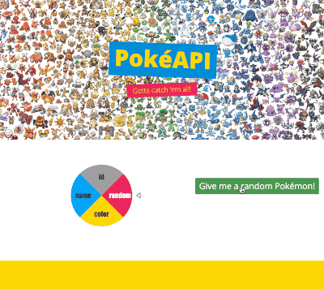

# PokéAPI

Skills you will be using:

  - JavaScript
  - AJAX
  - jQuery
  - HTML
  - CSS

You will also:
  - Import and use WheelNavJS, a JavaScript library http://wheelnavjs.softwaretailoring.net/index.html

### Getting Started
1. Download the zip file of this repo and unzip it into your projects folder
1. Download WheelNavJs from here: http://wheelnavjs.softwaretailoring.net/download.html
(Click the `Download` button under `Main`)
1. Unzip the downloaded file
1. Create a folder called WheelNavJS in the PokeAPI folder
1. Copy and paste the following files from the wheelnav.js-1.6.1 folder:  
    `raphael.min.js`  
    `raphael.icons.min.js`  
    `wheelnav.min.js`
1. In the `index.html` file, link up your javascript files, including the new WheelNavJS files you copied in.  
    Hint: That should look like this:  
    ``  
    ``  
    ``  
    ``
1. Start looking at the WheelNavJS documentation here: http://wheelnavjs.softwaretailoring.net/documentation/core.html
2. Copy the code under `Properties` and paste it into the `$(document).ready` function in your `main.js` file
3. Make any color, size, or other attribute changes you'd like by using the documentation. Be sure to change the labels on the wheel to: `random`, `color`, `name`, and `id`. Documentation on how to change those labels can be found here:  
    http://wheelnavjs.softwaretailoring.net/documentation/core.html
    Under `Methods`, click the `create` button to see an example of defining labels in the built-in `.createWheel` function.
4. Continue onto the **Making it Work** instructions.

### Getting Started
1. Take a look at the PokéAPI documentation here:  
    http://pokeapi.co/docsv2/#
2. The first API call should call a random Pokémon, so use the button already on the page (`Give me a random Pokémon!`) to trigger an API call for a random result. The button has already been set up to call a function called `randomPoke`.
3. The API endpoint for calling a Pokémon by ID is:
    `'http://pokeapi.co/api/v2/pokemon/RANDOM_NUMBER_HERE`
1. Using the above endpoint and generating a random number from 1 to 721, use AJAX (an example can be found in the State API project) to make the request. This should live outside of the `$(document).ready` function. For now, log your results to the console or look at the results in Postman to see how the response JSON is structured.
2. Using the results returned, disply on the page the Pokémon's `name`, `height`, `weight`, and `image` (image coming from `sprites/front_shiny`).

### Going further
Each piece of the the wheel has a different label. When each label is clicked, it should render a different button and, in some cases, a dropdown or form field for the user to input data.  
For example:
>When a user clicks the `color` section of the wheel, the wheel will spin and the `Give me a random Pokémon!` button should disappear while a dropdown of Pokémon colors and a new `Give me a Pokémon by color!` button should appear.

1. Check out the WheelNavJS documentation to find out how to run code after a different section of the wheel is clicked. An example of the built-in `.navigateFunction` can be found here, in the second section under `Navitem Basics`:
    http://wheelnavjs.softwaretailoring.net/documentation/navItem.html
1. Once your wheel navigation has been set, make sure the proper HTML elements are being displayed for whatever API call should be made (form field for searches by `name`, and `id`. drop down for searching by `color`. all four should have a button that executes the API call).
2. Look at the PokéAPI to find endpoints for searching by color and name. HINT: the endpoint for searching by ID is the same endpoint we used for the random search, just substituting the user input for the random number generated.

### Acceptance Criteria
> The term `acceptance criteria` is typically used with projects and tasks that are sent through quality testing. It defines the criteria used for determining when the project is considered `done and ready for deployment`

1. The `random` button should return a Pokémon's **name, height, weight, and image**.
2. The `color` button should return just the names of first 10 Pokémon for each color group. Pokémon color groups can be found on the interwebz.
3. The `name` button should return a Pokémon's **name, height, weight, and image**.
4. The `id` button should return a Pokémon's **name, height, weight, and image**.
5. The result should be styled in way that is pleasing to the eye.

##### Advanced Double API Call
5. When returning the first 10 names in a color group, make each name clickable so the user may click on a name to then find the Pokémon's **name, height, weight, and image**. (HINT: This will require a second API call, but the url will be handed to you in the result from the color search).

